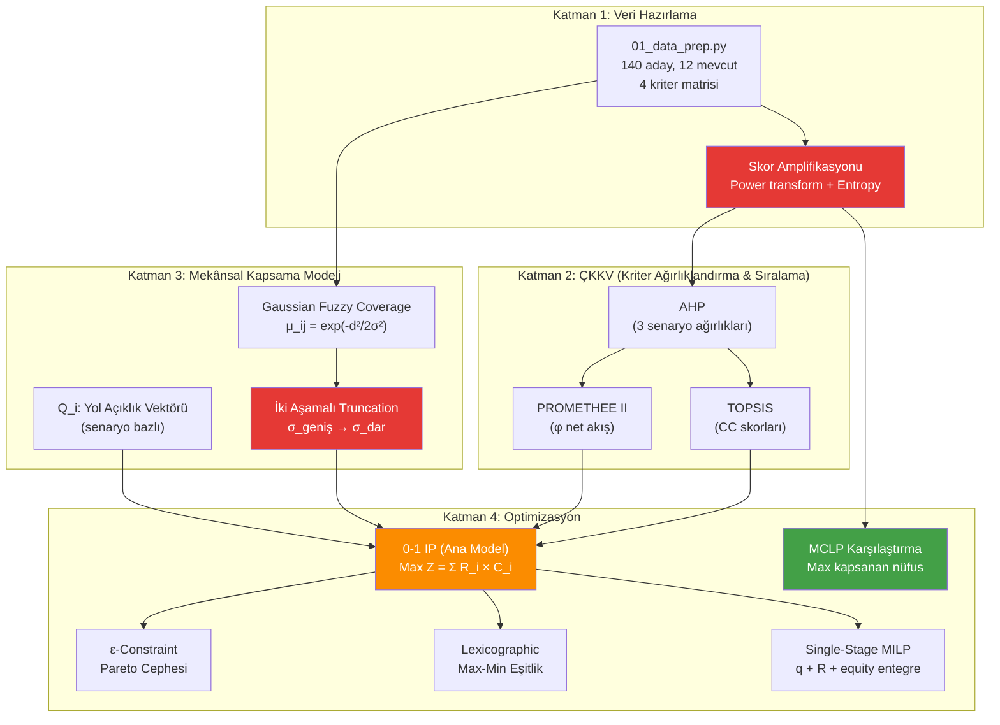
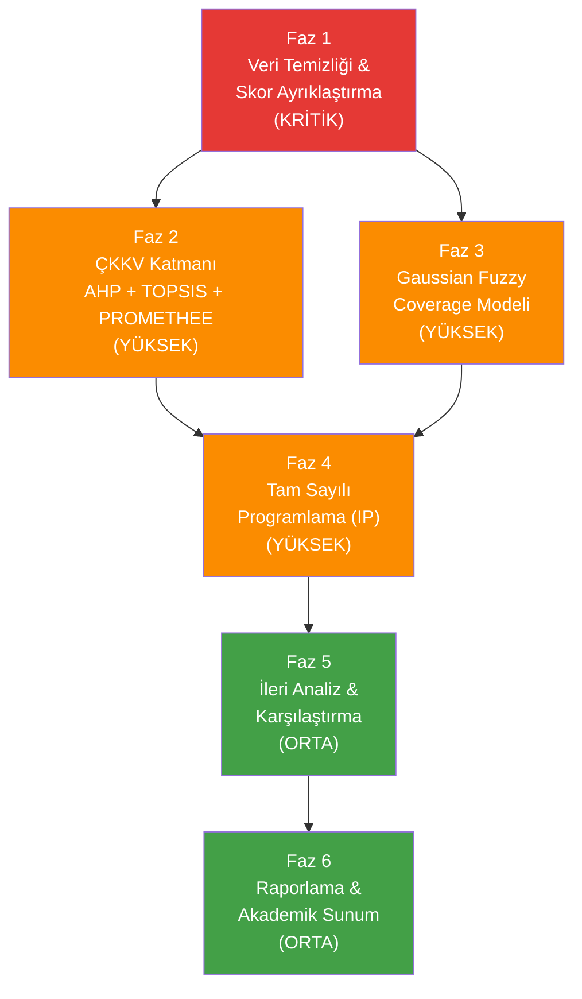

# IE492 — Sultanbeyli Afet Müdahale Konteyner Konum Optimizasyonu
# Birleşik Master Plan & Yürütme Spesifikasyonu

**Tarih:** 7 Haziran 2026, 00:44 (UTC+3)  
**Mimar:** Antigravity (Google DeepMind — Claude Opus 4.6 Thinking, Advanced Agentic Coding)  
**Amaç:** Sultanbeyli konteyner konum optimizasyonu projesinin tek referans belgesi (single source of truth). Tüm yöntemsel kararları, uygulama aşamalarını ve ilerleme takibini kapsar.

## Temel Tasarım İlkeleri

1. **AHP ağırlıkları karar mekanizmasına entegre olmalıdır** — sadece TOPSIS skor çarpanı değil, IP kısıtlarına da girmeli.
2. **Gaussian Fuzzy Coverage modeli sınır-aşırı kapsama sağlar** — bir konteyner birden fazla mahalleye hizmet edebilir; FCM-benzeri üyelik fonksiyonu bunu modeller.
3. **İki aşamalı truncation ile küçük aidiyetler elenir** — σ_geniş → σ_dar kademeli yaklaşım doğruluk artırır.
4. **Altyapısı iyi olan konum, aynı coğrafyada bile öncelikli seçilmelidir** — skor amplifikasyonu ile ayırt edicilik sağlanır.
5. **İki senaryo karşılaştırılmalıdır** — MEV (8 yeni + 12 mevcut) vs NMEV (20 baştan) gap analizi yapılmalı.

---

## İçindekiler

1. [Temel Problem](#1-temel-problem)
2. [Metodolojik Çerçeve](#2-metodolojik-çerçeve)
3. [Kriter & Veri Envanteri — Mevcut Durum](#3-kriter--veri-envanteri--mevcut-durum)
4. [Faz 1: Veri Temizliği & Skor Ayrıklaştırma](#faz-1-veri-temizliği--skor-ayrıklaştırma-kritik)
5. [Faz 2: ÇKKV Katmanı — AHP + TOPSIS + PROMETHEE](#faz-2-çkkv-katmanı--ahp--topsis--promethee-yüksek)
6. [Faz 3: Gaussian Fuzzy Coverage Modeli](#faz-3-gaussian-fuzzy-coverage-modeli-yüksek)
7. [Faz 4: Tam Sayılı Programlama (IP) Optimizasyonu](#faz-4-tam-sayılı-programlama-ip-optimizasyonu-yüksek)
8. [Faz 5: İleri Analiz & Karşılaştırma](#faz-5-ileri-analiz--karşılaştırma-orta)
9. [Faz 6: Raporlama & Akademik Sunum](#faz-6-raporlama--akademik-sunum-orta)
10. [Faz 7: Doğrulama Kontrol Listeleri](#doğrulama-kontrol-listeleri)
11. [Faz 8: İlerleme Güncellemesi (Progress Update)](#faz-8-ilerleme-güncellemesi-progress-update)

---

## 1. Temel Problem

**Depremde hasar alan evlere müdahale için konteyner konumlandırma:**

```
Deprem → Yapısal hasar → Evlere müdahale gereksinimi
                ↓
  Afet müdahale konteynerleri (malzeme deposu)
                ↓
  Sorun: Konteynerlerin mekânsal dağılımı dengesiz
                ↓
  Çözüm: Optimal konumlara yeni konteyner yerleştirme
```

### Problem Parametreleri

| Parametre | Değer | Kaynak |
|:----------|:------|:-------|
| Aday konum sayısı (parsel) | 140 | AYDES Toplanma Alanları |
| Mevcut konteyner sayısı | 12 | AFIS Konteyner Takip Çizelgesi |
| Mahalle sayısı (talep noktası) | 17 | Sultanbeyli Belediyesi |
| Yeni konteyner bütçesi (K) | 8 | Proje tanımı |
| Kriter sayısı | 4 | AHP yapısı |
| AHP senaryo sayısı | 3 | Baseline, DamageFocused, InfraFocused |

### İki Senaryo

| Senaryo | Açıklama | Değişken | Akademik Amaç |
|:--------|:---------|:---------|:--------------|
| **MEV** | 8 yeni + 12 mevcut (sabit) | X_j, j ∈ {1..140}, Σ X_j = 8 | Gerçekçi artımlı optimizasyon |
| **NMEV** | 20 baştan yerleştirme | X_j, j ∈ {1..140}, Σ X_j = 20 | Üst sınır (benchmark), mevcut yerleşimin optimallik farkı |

### Çözülmüş Tasarım Kararları

| Soru | Karar |
|:-----|:------|
| MCDM yöntemi | **Hem TOPSIS hem PROMETHEE** — tutarlılık kontrolü için ikisi de çalıştırılır |
| Kapsama modeli | **Gaussian Fuzzy Coverage** — ikili (binary) değil, dereceli (gradual) kapsama |
| FCM terminolojisi | **"Gaussian Bulanık Kapsama Modeli"** — Bezdek FCM değil, mekânsal üyelik hesabı |
| Skor amplifikasyonu | **Power transform (α=2) + Entropy ağırlıklandırma** — benzer lokasyonları ayırt etmek için |
| Mesafe hesabı | **Haversine (kuş uçuşu)** — yol ağı mesafesi opsiyonel karşılaştırma olarak eklenebilir |
| Altyapı bileşen ağırlıkları | **Eşit olmayan:** Su(0.35) > Jeneratör(0.30) > WC(0.20) > Kamera(0.15) |
| σ kalibrasyonu | **Grid araması** — σ ∈ {400, 600, 800, 1000, 1200} ile duyarlılık testi |
| Truncation eşiği | **μ < 0.15 → 0** — iki aşamalı: geniş σ ile hesapla, küçük aidiyetleri ele |
| Eşitlik ölçüsü | **Gini katsayısı + Lexicographic max-min** — hem ölçüm hem optimizasyon |
| Karşılaştırma modeli | **MCLP (Maximal Covering)** — ana modele benchmark olarak |

---

## 2. Metodolojik Çerçeve

### 2.1 Dört Katmanlı Pipeline Mimarisi



**Temel fark (eski pipeline'a göre):** AHP ağırlıkları sadece TOPSIS skor çarpanı değil, aynı zamanda IP kısıtlarına da entegre ediliyor (tiered minimum coverage). Skor amplifikasyonu ve iki aşamalı truncation yeni eklenen adımlar.

### 2.2 Yöntem Gerekçesi (Her Bileşen Neden Burada?)

| Bileşen | Rolü | Neden Bu Yöntem? | Akademik Referans |
|:--------|:-----|:-----------------|:------------------|
| **AHP** | Kriter ağırlıklandırma | Uzman görüşünü sistematik dahil eder; CR tutarlılık kontrolü sağlar | Saaty (1980) |
| **TOPSIS** | Aday sıralama (CC skoru) | İdeal/anti-ideal mesafe → kolay yorumlanır | Hwang & Yoon (1981) |
| **PROMETHEE II** | Aday sıralama (φ akış) | Tercih fonksiyonu tabanlı → kısmi kompansasyon | Brans & Vincke (1985) |
| **Gaussian Fuzzy Coverage** | Mekânsal kapsama üyeliği | Sınır konteynerlerin çift taraflı hizmet etmesini modeller | Berman & Krass (2002) |
| **0-1 IP** | Konum seçimi optimizasyonu | Kesin (exact) çözüm, K=8 ölçeğinde dakikalar içinde | Daskin (2013) |
| **MCLP** | Karşılaştırma modeli | Kapsama maksimizasyonu → farklı perspektif sunar | Church & ReVelle (1974) |
| **ε-Constraint** | Pareto cephesi | RxC vs min_cov trade-off'u görselleştirir | Haimes et al. (1971) |
| **Gini** | Eşitlik ölçümü | Mahalle kapsama dağılımının adaletini ölçer | Gini (1912) |
| **Compromise** | Pareto seçimi | İdeal noktaya en yakın çözüm (L_p mesafe) | Zeleny (1973) |

### 2.3 Skor Amplifikasyonu — Yeni Bileşen

**Problem:** Yan yana konumlarda benzer puanlar alınıyor, altyapısı iyi olan ayırt edilemiyor.

**Çözüm:** İki tekniğin kombinasyonu:

```python
# Teknik 1: Power Transform (α=2) — farkları büyütür
score_amplified = score_j ** 2
# 0.7 vs 0.9 → fark 0.2
# 0.49 vs 0.81 → fark 0.32 (%60 artış)

# Teknik 2: Entropy Ağırlıklandırma — ayırt edici kriterleri ödüllendirir
E_j = -Σ p_ij × ln(p_ij)     # Shannon entropy
d_j = 1 - E_j / ln(n)        # Ayırt edicilik
w_final_j = (w_AHP_j × d_j) / Σ(w_AHP_j × d_j)  # Hibrit ağırlık
```

**Etki:** Tüm adayların benzer olduğu kriterler (ör. barınma talebi) otomatik ağırlık kaybeder; farklılaştırıcı kriterler (ör. altyapı skoru) ağırlık kazanır.

### 2.4 Gaussian Fuzzy Coverage — Neden FCM Değil?

Senin kavramsal düşüncen doğru ama terminoloji ayrımı şart:

| | Bezdek FCM (1981) | Senin Modelinin (Gaussian Fuzzy Coverage) |
|:--|:---|:---|
| **Amaç** | Veri noktalarını kümelere ayırma | Bir noktanın mahallelere hizmet oranını belirleme |
| **Üyelik** | Σ_i μ_ij = 1 (zorunlu) | Σ_i μ_ij ≠ 1 (bağımsız, her mahalle ayrı) |
| **Sonuç** | μ(A)=0.7, μ(B)=0.3 | μ(A)=0.93, μ(B)=0.88 → **TEK konteyner İKİ mahalleye yüksek hizmet** |
| **İterasyon** | Var (küme merkezi güncelleme) | Yok (direkt mesafe hesabı) |

**Raporda kullanılacak terim:** "Gaussian Bulanık Kapsama Modeli (Gaussian Fuzzy Coverage Model)" veya kısaca "Bulanık Mekânsal Üyelik Fonksiyonu"

**İki aşamalı truncation kavramı:**
```
Aşama 1: σ_geniş=800m ile geniş kapsama hesapla
  → Hangi konteyner hangi mahallelere potansiyel hizmet edebilir?
  → μ < 0.15 olanları sıfırla (hayalet kapsama eleme)

Aşama 2: σ_dar=300m ile dar kapsama hesapla (opsiyonel)
  → max(μ_800, μ_300) al → yakın mahallelerde kapsama güçlendirme
  → CA8c sonuçları: En yüksek RxC (976.31) — iki aşamalının etkinliğinin kanıtı
```

---

## 3. Kriter & Veri Envanteri — Mevcut Durum

### 3.1 Kaynak Dosyalar

| Dosya | İçerik | Konum | Durum |
|:------|:-------|:------|:------|
| Aday parseller (140) | Koordinat, altyapı (Su/WC/Jen/Kamera) | `data/processed/adaylar_140.xlsx` | ✅ Hazır |
| Mevcut konteynerler (12) | container_no, mahalle, enlem, boylam | `data/processed/mevcut_12.xlsx` | ✅ Hazır |
| Mahalle nüfus | nüfus_2024 | `data/processed/mahalle_nufus.xlsx` | ✅ Hazır |
| Mahalle risk | risk_score (0-50) | `data/processed/mahalle_risk.xlsx` | ✅ Hazır |
| Mahalle barınma | hane_ihtiyaci | `data/processed/mahalle_barinma.xlsx` | ✅ Hazır |
| Kriter matrisi | 140 × 4 kriter | `data/processed/criteria_matrix.xlsx` | ✅ Hazır |
| Mahalle centroid | lat, lon | `data/processed/mahalle_centroids.xlsx` | ✅ Hazır |
| p_access_road | parsel bazlı yol erişimi | `data/processed/adaylar_140.xlsx` | ⚠️ Sentetik |
| p_road_open | mahalle bazlı yol açıklığı | `data/processed/p_road_open.xlsx` | ⚠️ Sentetik |

### 3.2 Mevcut Kaynak Kod Dosyaları

| Dosya | İşlev | Satır | Durum |
|:------|:------|:------|:------|
| [01_data_prep.py](file:///d:/IE492/src/01_data_prep.py) | Veri hazırlama, kriter matrisi | 254 | ✅ Çalışıyor — güncelleme gerekecek |
| [02_ahp_weights.py](file:///d:/IE492/src/02_ahp_weights.py) | AHP ağırlıkları (3 senaryo) | 129 | ⚠️ İkili karşılaştırma matrisi hardcoded |
| [03a_topsis.py](file:///d:/IE492/src/03a_topsis.py) | TOPSIS CC skorları | 102 | ✅ Standart uygulama |
| [03b_promethee.py](file:///d:/IE492/src/03b_promethee.py) | PROMETHEE II φ akışları | 119 | ✅ Standart uygulama |
| [04_fcm.py](file:///d:/IE492/src/04_fcm.py) | Gaussian üyelik matrisi | 290 | ⚠️ Terminoloji güncellenmeli |
| [05_ip.py](file:///d:/IE492/src/05_ip.py) | 0-1 IP çözümü (6 versiyon) | 372 | ⚠️ AHP entegrasyonu eksik |
| [06_compare.py](file:///d:/IE492/src/06_compare.py) | TOPSIS vs PROMETHEE karşılaştırma | 326 | ✅ İyi |
| [07_reporting.py](file:///d:/IE492/src/07_reporting.py) | Raporlama | 738 | ✅ Çalışıyor |
| [08_lscp.py](file:///d:/IE492/src/08_lscp.py) | LSCP set kapsama | 196 | ✅ İyi |
| [09_gini.py](file:///d:/IE492/src/09_gini.py) | Gini eşitsizliği | 109 | ✅ İyi |
| [10_infra_score.py](file:///d:/IE492/src/10_infra_score.py) | Altyapı skoru | 178 | ⚠️ Ağırlıksız ortalama → güncellenmeli |
| [11_lexicographic.py](file:///d:/IE492/src/11_lexicographic.py) | Lexicographic max-min | 218 | ✅ Akademik |
| [12_sigma_grid.py](file:///d:/IE492/src/12_sigma_grid.py) | σ duyarlılık analizi | 152 | ✅ İyi |
| [13_eps_constraint.py](file:///d:/IE492/src/13_eps_constraint.py) | ε-constraint Pareto | 179 | ✅ Akademik |
| [14_single_stage.py](file:///d:/IE492/src/14_single_stage.py) | Tek aşamalı MILP (en gelişmiş) | 192 | ✅ Akademik |
| [15_compromise.py](file:///d:/IE492/src/15_compromise.py) | L_p uzlaşma çözüm | 116 | ✅ Akademik |
| [scenario_utils.py](file:///d:/IE492/src/scenario_utils.py) | Q_i yükleme, FCM yol yardımcıları | 207 | ✅ Çalışıyor |
| [run_all_scenarios.py](file:///d:/IE492/src/run_all_scenarios.py) | Toplu senaryo çalıştırma | 901 | ✅ Çalışıyor |

### 3.3 Arşiv Çözüm Alternatifleri (13 Konfigürasyon)

| CA | Açıklama | Mod | RxC | Durum |
|:---|:---------|:----|:----|:------|
| CA1 | Referans (baseline) | MEV | 935.62 | ✅ Tamamlandı |
| CA2 | + Yol kapanması (Q_i) | MEV | 933.01 | ✅ Tamamlandı |
| CA3 | Tam relokasyon (SB+YK) | NMEV | 1201.22 | ✅ Tamamlandı |
| CA4 | Tam relokasyon (SB) | NMEV | 1201.22 | ✅ = CA3 (yapısal eşdeğer) |
| CA5 | Tam relokasyon (YK) | NMEV | 1201.22 | ✅ = CA3 (yapısal eşdeğer) |
| CA6 | Tam relokasyon (baseline) | NMEV | 1201.22 | ✅ = CA3 (yapısal eşdeğer) |
| CA7 | Risk-proportional kapsama | MEV/NMEV | 935.62/894.86 | ✅ Tamamlandı |
| CA8a | Truncation μ<0.20→0 | MEV | 853.51 | ✅ Tamamlandı |
| CA8b | Adaptif σ | MEV | 677.35 | ✅ Tamamlandı (en kötü) |
| CA8c | İki kademeli σ (800+300) | MEV | 976.31 | ✅ **En iyi MEV sonucu** |
| CA9a | Min 1 konteyner/mahalle | MEV | 923.04 | ✅ Tamamlandı |
| CA9b | Min 1 + yol kapanması | MEV | 790.40 | ✅ Tamamlandı |
| CA9c | Min 1 + truncation | MEV | 837.96 | ✅ Tamamlandı |

---

## Faz 1: Veri Temizliği & Skor Ayrıklaştırma (KRİTİK) — Durum: TAMAMLANDI

> **Risk:** 🟢 Düşük — Mevcut verilere dokunulmaz, yeni sütunlar eklenir.  
> **Amaç:** Kriter matrisini güçlendirmek, skor ayrıklaştırma uygulamak, sentetik verileri belgelemek.  
> **Bağımlılık:** Yok (ilk aşama).

### Önce İncelenmesi Gereken Dosyalar

| Dosya | Neden |
|:------|:------|
| [01_data_prep.py](file:///d:/IE492/src/01_data_prep.py) | C2 altyapı skoru eşit ağırlıklı → ağırlıklı bileşik gerekir |
| [02_ahp_weights.py](file:///d:/IE492/src/02_ahp_weights.py) | İkili karşılaştırma matrisi açık yazılmalı |
| [10_infra_score.py](file:///d:/IE492/src/10_infra_score.py) | Altyapı skoru güncellenecek |

### Görev 1.1: Altyapı Kriteri Ağırlıklı Bileşik Skora Geçiş

**Dosya:** `src/01_data_prep.py` (MODIFY — ~10 satır)

```python
# Mevcut (L179):
adaylar["C2_lojistik"] = adaylar[["Su_bin","WC_bin","Jen_bin","Kamera_bin"]].mean(axis=1)

# Yeni:
W_INFRA = {"Su_bin": 0.35, "Jen_bin": 0.30, "WC_bin": 0.20, "Kamera_bin": 0.15}
adaylar["C2_lojistik"] = sum(
    adaylar[col] * w for col, w in W_INFRA.items()
)
```

**Gerekçe:** Deprem müdahalesinde su en kritik (yaşamsal), jeneratör enerji bağımsızlığı sağlar, WC hijyen, kamera güvenlik. Eşit ağırlık bu önceliği yansıtmaz.

### Görev 1.2: Power Transform Amplifikasyonu

**Dosya:** `src/01_data_prep.py` (MODIFY — ~15 satır)

```python
# Kriter matrisi oluşturduktan sonra, normalize edilmiş skorlara power transform uygula
ALPHA_POWER = 2  # Üstel amplifikasyon katsayısı

for col in ["C1_hasar_risk", "C2_lojistik", "C3_bosluk_norm", "C4_barinma"]:
    # Min-max normalize (0-1)
    c_min, c_max = criteria[col].min(), criteria[col].max()
    criteria[f"{col}_norm"] = (criteria[col] - c_min) / (c_max - c_min + 1e-9)
    # Power transform
    criteria[f"{col}_amp"] = criteria[f"{col}_norm"] ** ALPHA_POWER
```

### Görev 1.3: Entropy Ağırlıklandırma Modülü

**Dosya:** `src/01b_entropy_weights.py` (YENİ — ~80 satır)

```python
def entropy_weights(matrix: np.ndarray) -> np.ndarray:
    """Shannon entropy tabanlı objektif ağırlıklar."""
    n, k = matrix.shape
    # Normalize (proportion)
    P = matrix / matrix.sum(axis=0, keepdims=True)
    P = np.clip(P, 1e-12, 1.0)
    # Entropy
    E = -np.sum(P * np.log(P), axis=0) / np.log(n)
    # Ayırt edicilik
    d = 1.0 - E
    return d / d.sum()

def hybrid_weights(w_ahp: np.ndarray, w_entropy: np.ndarray) -> np.ndarray:
    """AHP × Entropy hibrit ağırlık."""
    w = w_ahp * w_entropy
    return w / w.sum()
```

### Görev 1.4: Sentetik Veri Belgelendirme

**Dosya:** `docs/sentetik_veri_notu.md` (YENİ — ~30 satır)

Aşağıdaki değişkenlerin sentetik olduğunu açıkça belgelendir:
- `p_access_road`: `np.random.seed(42)` ile üretilmiş, mahalle ortalamalarına Gaussian gürültü eklenmiş
- `p_road_open`: Aynı şekilde sentetik
- **Duyarlılık testi zorunlu:** Bu değişkenlerin ±%20 değiştirilmesiyle sonuçların ne kadar etkilendiği raporlanmalı

### Görev 1.5: AHP İkili Karşılaştırma Matrislerini Açık Yaz

**Dosya:** `src/02_ahp_weights.py` (MODIFY — ~40 satır)

```python
# Mevcut: Sadece sonuç ağırlıklar hardcoded
# Yeni: İkili karşılaştırma matrislerini açıkça yaz

# Baseline senaryosu — 4x4 pairwise comparison matrix
A_baseline = np.array([
    [1,    3,    5,    7],    # C1 vs C1,C2,C3,C4
    [1/3,  1,    3,    5],    # C2 vs ...
    [1/5,  1/3,  1,    3],    # C3 vs ...
    [1/7,  1/5,  1/3,  1],    # C4 vs ...
])
# Eigenvalue hesaplama ve CR doğrulama
eigenvalues, eigenvectors = np.linalg.eig(A_baseline)
# ... CR < 0.10 kontrolü
```

### Faz 1 Doğrulama

```bash
python src/01_data_prep.py
python src/01b_entropy_weights.py
python src/02_ahp_weights.py
# Kontrol: Altyapı ağırlıklı bileşik skoru doğru mu?
python -c "import pandas as pd; df=pd.read_excel('data/processed/criteria_matrix.xlsx'); print(df[['C2_lojistik']].describe())"
# Kontrol: Entropy ağırlıkları makul mü?
python -c "from src.entropy_weights import entropy_weights; import numpy as np; print(entropy_weights(np.random.rand(140,4)))"
```

---

## Faz 2: ÇKKV Katmanı — AHP + TOPSIS + PROMETHEE (YÜKSEK) — Durum: TAMAMLANDI

> **Risk:** 🟡 Orta — Normalizasyon değişikliği TOPSIS sonuçlarını etkiler.  
> **Amaç:** Skor amplifikasyonu ve entropy ağırlıklar ile ÇKKV tekrar çalıştırmak.  
> **Bağımlılık:** Faz 1 tamamlanmış olmalı.

### Görev 2.1: TOPSIS Normalizasyon Güncellemesi

**Dosya:** `src/03a_topsis.py` (MODIFY — ~20 satır)

```python
# Mevcut (L2 vektör normalizasyonu):
norm = np.sqrt((mat ** 2).sum(axis=0))
R = mat / norm

# Alternatif (Min-Max normalizasyonu — farkları korur):
R = (mat - mat.min(axis=0)) / (mat.max(axis=0) - mat.min(axis=0) + 1e-12)
```

**Not:** Her iki normalizasyon yöntemini çalıştır, sonuçları karşılaştır. Raporda ikisini de sun.

### Görev 2.2: AHP-Entropy Hibrit Ağırlık Entegrasyonu

**Dosya:** `src/03a_topsis.py` ve `src/03b_promethee.py` (MODIFY — ~15 satır/dosya)

```python
# AHP ağırlıkları + Entropy ağırlıkları → Hibrit
from entropy_weights import hybrid_weights, entropy_weights

w_entropy = entropy_weights(mat)
w_ahp = np.array([wrow["C1_Nufus"], wrow["C2_Deprem"], wrow["C3_Erisim"], wrow["C4_Ulasim"]])
w_hybrid = hybrid_weights(w_ahp, w_entropy)
```

### Görev 2.3: TOPSIS-PROMETHEE Tutarlılık Raporu

**Dosya:** `src/06_compare.py` (MODIFY — mevcut kodu genişlet)

Eklenmesi gerekenler:
- Amplifikasyon öncesi vs sonrası Spearman korelasyonu
- L2 vs Min-Max normalizasyonu karşılaştırması
- AHP-only vs AHP-Entropy hibrit ağırlık etkisi

### Faz 2 Doğrulama

```bash
python src/03a_topsis.py
python src/03b_promethee.py
python src/06_compare.py
# Kontrol: Top-10 sıralama değişti mi?
python -c "
import pandas as pd
old = pd.read_excel('results/mcdm/topsis_cc.xlsx')
# yeni sonuçlarla karşılaştır
"
```

---

## Faz 3: Gaussian Fuzzy Coverage Modeli (YÜKSEK) — Durum: TAMAMLANDI

> **Risk:** 🔴 Yüksek — Optimizasyon modelinin belkemiği.  
> **Amaç:** Doğru terim (Gaussian Fuzzy) kullanımı, iki aşamalı etki mesafesi (sigma) kalibrasyonu ve hayalet kapsama (truncation) kesimi.  
> **Bağımlılık:** Faz 1 verileri tamam olmalı.

### Görev 3.1: Terminoloji Düzeltmesi

**Dosyalar:** Tüm dosyalarda "FCM" ifadesi → "Gaussian Fuzzy Coverage" veya "Bulanık Mekânsal Üyelik"

| Mevcut Terim | Yeni Terim |
|:-------------|:-----------|
| `04_fcm.py` | `04_fuzzy_coverage.py` (dosya adı değişikliği) |
| `FCM_DIR` | `FUZZY_COV_DIR` |
| `fcm_paths()` | `fuzzy_coverage_paths()` |
| `results/fcm/` | `results/fuzzy_coverage/` |
| Tüm dokümanlarda "FCM" | "Gaussian Bulanık Kapsama Modeli" |

### Görev 3.2: İki Aşamalı Truncation Formalizasyonu

**Dosya:** `src/04_fuzzy_coverage.py` (MODIFY — ~30 satır)

```python
def two_stage_fuzzy_coverage(D: np.ndarray, sigma_wide: float = 800, 
                              sigma_narrow: float = 300,
                              truncation_threshold: float = 0.15) -> np.ndarray:
    """
    İki aşamalı Gaussian Bulanık Kapsama:
    1) σ_geniş ile kaba üyelik → düşük aidiyetleri sıfırla
    2) σ_dar ile dar üyelik → yakın mahallelerde güçlendirme
    3) max(μ_geniş, μ_dar) → birleşik kapsama
    """
    mu_wide = np.exp(-(D ** 2) / (2 * sigma_wide ** 2))
    mu_narrow = np.exp(-(D ** 2) / (2 * sigma_narrow ** 2))
    
    # Truncation: çok düşük aidiyetleri ele
    mu_wide[mu_wide < truncation_threshold] = 0.0
    mu_narrow[mu_narrow < truncation_threshold] = 0.0
    
    # Birleşik: iki ölçeğin maksimumu
    mu_combined = np.maximum(mu_wide, mu_narrow)
    
    return mu_combined
```

### Görev 3.3: σ Kalibrasyonu için Çapraz-Doğrulama

**Dosya:** `src/12b_sigma_calibration.py` (YENİ — ~100 satır)

```python
def leave_one_out_sigma_calibration(mevcut_coords, aday_coords, sigmas):
    """
    Her mevcut konteyneri sırayla çıkar → kalan konteynerlerle IP çöz
    → çıkarılan konteynerin seçilip seçilmediğini kontrol et
    → En yüksek 'geri kazanım oranı' veren σ'yı seç
    """
    recovery_rates = {}
    for sigma in sigmas:
        recovered = 0
        for i in range(len(mevcut_coords)):
            # i. mevcut konteyneri çıkar
            # Kalan konteynerlerle IP çöz
            # Seçilen adaylar arasında i'ye en yakın olanı bul
            # Eğer mesafe < eşik → recovered += 1
        recovery_rates[sigma] = recovered / len(mevcut_coords)
    return recovery_rates
```

### Görev 3.4: Kapsama Sınırı Haritası

**Dosya:** `src/04b_coverage_boundary.py` (YENİ — ~60 satır)

Her σ değeri için μ=0.50 ve μ=0.10 eşik mesafelerini hesapla ve raporla:

| σ (m) | μ=0.50 mesafe (m) | μ=0.10 mesafe (m) | Yorum |
|:------|:-------------------|:-------------------|:------|
| 400 | 333 | 535 | Çok dar — yetersiz kapsama |
| 600 | 499 | 803 | Dar — mahalle-içi kapsama |
| **800** | **665** | **1070** | **Varsayılan — orta kapsama** |
| 1000 | 832 | 1338 | Geniş — mahalleler-arası kapsama |
| 1200 | 998 | 1605 | Çok geniş — aşırı overlap |

### Faz 3 Doğrulama

```bash
python src/04_fuzzy_coverage.py --sigma 800
python src/04_fuzzy_coverage.py --sigma 800_300
python src/12_sigma_grid.py
python src/12b_sigma_calibration.py
# Kontrol: İki aşamalı truncation etkisi
python -c "
import pandas as pd
mu1 = pd.read_excel('results/fuzzy_coverage/mu_aday_140x17_s800.xlsx')
mu2 = pd.read_excel('results/fuzzy_coverage/mu_aday_140x17_s800_300.xlsx')
print(f'Tek σ: sıfır-olmayan μ = {(mu1.iloc[:,1:] > 0).sum().sum()}')
print(f'İki σ: sıfır-olmayan μ = {(mu2.iloc[:,1:] > 0).sum().sum()}')
"
```

---

## Faz 4: 0-1 Tamsayılı Optimizasyon (YÜKSEK) — Durum: TAMAMLANDI

> **Risk:** 🔴 Yüksek — Amaç fonksiyonunda değişiklik ve senaryo eklemeleri var.  
> **Amaç:** IP modelini yeni skorlarla çalıştırmak ve k=8 ile k=20 karşılaştırmasını eklemek.  
> **Bağımlılık:** Faz 2 ve Faz 3 tamamlanmış olmalı.

### Görev 4.1: AHP Ağırlıklarını IP Kısıtlarına Entegre Et

**Dosya:** `src/05_ip.py` (MODIFY — ~30 satır)

```python
# Mevcut: AHP sadece Z_quality teriminde (CC_j × X_j)
# Yeni: AHP ağırlıklarına göre mahalle-bazlı minimum kapsama kısıtları

# AHP'den türetilen mahalle öncelik katmanları:
# Tier 1 (yüksek risk + yüksek nüfus): min kapsama >= 0.80
# Tier 2 (orta risk veya orta nüfus): min kapsama >= 0.60
# Tier 3 (düşük risk + düşük nüfus): min kapsama >= 0.40

for mh in mahalleler:
    tier = get_ahp_tier(mh, risk_dict, nufus_dict, ahp_weights)
    if tier == 1:
        prob += coverage[mh] >= 0.80, f"ahp_tier1_{mh}"
    elif tier == 2:
        prob += coverage[mh] >= 0.60, f"ahp_tier2_{mh}"
    else:
        prob += coverage[mh] >= 0.40, f"ahp_tier3_{mh}"
```

### Görev 4.2: MCLP Karşılaştırma Modeli

**Dosya:** `src/16_mclp.py` (YENİ — ~120 satır)

```python
"""
16_mclp.py
Maximal Covering Location Problem (Church & ReVelle, 1974)
Kapsama yarıçapı S ile en fazla ağırlıklı talebi kapsayan K konumu seç.

Formülasyon:
  max Σ_i w_i × z_i
  s.t. z_i ≤ Σ_{j∈N_i} x_j    ∀i
       Σ_j x_j ≤ K
       z_i, x_j ∈ {0,1}
       N_i = {j : d_ij ≤ S}
"""

S_VALUES = [500, 750, 1000]  # Kapsama yarıçapı alternatifleri

def solve_mclp(adaylar, mahalleler, mevcut, K, S, w_i):
    """MCLP çöz — mevcut konteynerlerle artımlı kapsama."""
    # Mevcut konteynerlerle zaten kapsanan mahalleleri belirle
    # Kapsanmayan/kısmen kapsanan mahalleleri hedefle
    # w_i = nüfus_i × risk_i (AHP-Entropy hibrit ağırlık)
    pass
```

### Görev 4.3: MEV vs NMEV Gap Analizi

**Dosya:** `src/17_gap_analysis.py` (YENİ — ~80 satır)

```python
"""
MEV vs NMEV optimality gap analizi.
Mevcut yerleşimin ne kadar optimal-dışı olduğunu ölçer.

Gap = (RxC_NMEV - RxC_MEV) / RxC_NMEV × 100
"""
```

### Görev 4.4: p-Median Karşılaştırma (Opsiyonel)

**Dosya:** `src/18_p_median.py` (YENİ — ~100 satır)

```python
"""
p-Median Problem (Hakimi, 1964)
Ortalama erişim mesafesini minimize eden K konumu seç.

min Σ_i Σ_j w_i × d_ij × y_ij
"""
```

### Faz 4 Doğrulama

```bash
python src/05_ip.py --scenario A --K 8    # MEV
python src/05_ip.py --scenario A --K 20 --no-mevcut  # NMEV
python src/16_mclp.py --S 750 --K 8       # MCLP karşılaştırma
python src/17_gap_analysis.py              # MEV vs NMEV gap
# Kontrol: AHP tier kısıtları çalışıyor mu?
python -c "
import pandas as pd
df = pd.read_excel('results/models/summary_all_SA.xlsx')
print(df[['version','min_mahalle_cov','avg_mahalle_cov']])
"
```

---

## Faz 5: İleri Analiz & Karşılaştırma (ORTA) — Durum: BEKLEMEDE

> **Risk:** 🟢 Düşük — Post-hoc analiz, mevcut sonuçlar üzerine.  
> **Amaç:** Pareto cephesi, eşitlik analizi, duyarlılık testi tamamlamak.  
> **Bağımlılık:** Faz 4 tamamlanmış olmalı.

### Görev 5.1: Pareto Cephesi (ε-Constraint) Güncelleme

**Dosya:** `src/13_eps_constraint.py` (MODIFY — güncelleme)

Yeni AHP-entegre IP ile ε-constraint tekrar çalıştır.

### Görev 5.2: Lexicographic Max-Min Güncelleme

**Dosya:** `src/11_lexicographic.py` (MODIFY — güncelleme)

### Görev 5.3: Compromise Programming Güncelleme

**Dosya:** `src/15_compromise.py` (MODIFY — güncelleme)

### Görev 5.4: Sentetik Veri Duyarlılık Testi

**Dosya:** `src/19_sensitivity_synthetic.py` (YENİ — ~100 satır)

```python
"""
p_access_road ve p_road_open'ın ±%20 değiştirilmesiyle
seçilen konumların ne kadar değiştiğini test et.
"""
```

### Görev 5.5: Gini Eşitlik Güncelleme

**Dosya:** `src/09_gini.py` (MODIFY — güncelleme)

### Faz 5 Doğrulama

```bash
python src/13_eps_constraint.py --scenario A
python src/11_lexicographic.py --scenario A
python src/15_compromise.py --scenario A
python src/19_sensitivity_synthetic.py
python src/09_gini.py
```

---

## Faz 6: Raporlama & Akademik Sunum (ORTA) — Durum: BEKLEMEDE

> **Risk:** 🟢 Düşük — Raporlama, sonuçlar üzerine.  
> **Amaç:** Akademik rapor, görseller, bulgular dokümantasyonu.  
> **Bağımlılık:** Faz 5 tamamlanmış olmalı.

### Görev 6.1: Final Karşılaştırma Tablosu

Tüm yöntemlerin (IP, MCLP, Lexicographic, Single-Stage, Compromise) sonuçlarını tek tabloda sun.

### Görev 6.2: Görselleştirme Güncellemesi

- Pareto cephesi grafiği (RxC vs min_cov)
- Mahalle kapsama haritası (mevcut vs yeni)
- σ duyarlılık grafiği
- Gini Lorenz eğrisi
- MEV vs NMEV karşılaştırma

### Görev 6.3: Akademik Rapor Bölümleri

1. Giriş & Problem Tanımı
2. Literatür Taraması
3. Metodoloji (4 katmanlı pipeline)
4. Veri & Kriter Açıklaması
5. Deneysel Sonuçlar (13 CA + yeni yöntemler)
6. Duyarlılık Analizi
7. Tartışma & Karşılaştırma
8. Sonuç & Öneriler

---

## Doğrulama Kontrol Listeleri

### Veri Bütünlüğü

```bash
# 140 aday × 4 kriter matrisi tutarlı mı?
python -c "
import pandas as pd
c = pd.read_excel('data/processed/criteria_matrix.xlsx')
assert c.shape[0] == 140, f'Aday sayısı {c.shape[0]} != 140'
assert 'C1_hasar_risk' in c.columns
assert 'C2_lojistik' in c.columns
assert 'C3_bosluk_m' in c.columns
assert 'C4_barinma' in c.columns
print(f'OK: {c.shape}')
"
```

### Yöntem Tutarlılığı

```bash
# AHP CR < 0.10 doğrulama
python -c "
import pandas as pd
w = pd.read_excel('results/ahp/ahp_weights.xlsx')
for _, r in w.iterrows():
    assert r['CR'] < 0.10, f'{r[\"scenario\"]} CR={r[\"CR\"]} >= 0.10!'
print('AHP CR: OK')
"

# TOPSIS ve PROMETHEE korelasyonu
python -c "
import pandas as pd, numpy as np
t = pd.read_excel('results/mcdm/topsis_cc.xlsx')
p = pd.read_excel('results/mcdm/promethee_phi.xlsx')
r = np.corrcoef(t['CC_Baseline'], p['phi_Baseline'])[0,1]
print(f'TOPSIS-PROMETHEE Pearson: {r:.4f}')
assert r > 0.5, 'Korelasyon çok düşük!'
"
```

### Optimizasyon Çözüm Kalitesi

```bash
# Tüm mahalleler minimum kapsama eşiğini karşılıyor mu?
python -c "
import pandas as pd
for f in ['coverage_v1_SA_TOPSIS_Baseline.xlsx']:
    df = pd.read_excel(f'results/models/{f}')
    min_cov = df['toplam_kapsama'].min()
    print(f'{f}: min_cov = {min_cov:.4f}')
    assert min_cov >= 0.05, f'Minimum kapsama eşiği sağlanmıyor!'
print('Kapsama: OK')
"
```

---

## Yürütme Sırası & Bağımlılıklar



> [!IMPORTANT]
> **AI ajanları için:** Her faz kendi Doğrulama bölümüne sahiptir. Bir fazı tamamladıktan sonra TÜM doğrulama komutlarını çalıştırın. Herhangi bir kontrol başarısız olursa, bir sonraki faza geçmeden önce düzeltin.

---

## Dosya Özeti — Tüm Fazlar

| Faz | Dosya | Aksiyon | ~Satır |
|:----|:------|:--------|:-------|
| 1 | `src/01_data_prep.py` | MODIFY | ~25 |
| 1 | `src/01b_entropy_weights.py` | YENİ | ~80 |
| 1 | `src/02_ahp_weights.py` | MODIFY | ~40 |
| 1 | `docs/sentetik_veri_notu.md` | YENİ | ~30 |
| 2 | `src/03a_topsis.py` | MODIFY | ~20 |
| 2 | `src/03b_promethee.py` | MODIFY | ~15 |
| 2 | `src/06_compare.py` | MODIFY | ~30 |
| 3 | `src/04_fcm.py` → `src/04_fuzzy_coverage.py` | RENAME + MODIFY | ~30 |
| 3 | `src/12b_sigma_calibration.py` | YENİ | ~100 |
| 3 | `src/04b_coverage_boundary.py` | YENİ | ~60 |
| 3 | `src/scenario_utils.py` | MODIFY (terminoloji) | ~10 |
| 4 | `src/05_ip.py` | MODIFY | ~30 |
| 4 | `src/16_mclp.py` | YENİ | ~120 |
| 4 | `src/17_gap_analysis.py` | YENİ | ~80 |
| 4 | `src/18_p_median.py` | YENİ (opsiyonel) | ~100 |
| 5 | `src/13_eps_constraint.py` | MODIFY | ~10 |
| 5 | `src/11_lexicographic.py` | MODIFY | ~10 |
| 5 | `src/15_compromise.py` | MODIFY | ~10 |
| 5 | `src/19_sensitivity_synthetic.py` | YENİ | ~100 |
| 5 | `src/09_gini.py` | MODIFY | ~10 |
| 6 | `src/07_reporting.py` | MODIFY | ~100 |
| 6 | `docs/final_rapor.md` | YENİ | ~500 |

**Toplam tahmini:** ~7 yeni dosya, ~12 değişiklik, ~1,500 yeni satır

---

## İlerleme Güncellemesi (Progress Update)

### 2026-06-07 — Master Plan Oluşturuldu

Başlangıç durumu:

- **Mevcut altyapı:** 15 betik, 13 çözüm alternatifi (CA1-CA9c), kapsamlı arşiv
- **En iyi MEV sonucu:** CA8c (iki kademeli σ=800+300) → RxC = 976.31
- **En iyi NMEV sonucu:** CA3-6 (tam relokasyon) → RxC = 1201.22
- **Kritik bulgu:** AHP 3 senaryosu arasında varyans %0.0 (CA1-CA8c) → AHP karar etkisi sıfır
- **Yapısal eşdeğerlik:** CA3=CA4=CA5=CA6=1201.22 → aslında tek alternatif

Planlanan iyileştirmeler:

| # | İyileştirme | Faz | Beklenen Etki |
|:--|:-----------|:----|:-------------|
| 1 | Altyapı ağırlıklı bileşik skor | Faz 1 | Altyapısı iyi olan konumlar ayrışır |
| 2 | Power transform amplifikasyonu | Faz 1 | Benzer skorlar ayrıklaşır |
| 3 | Entropy ağırlıklandırma | Faz 1 | Ayırt edici kriterler ödüllendirilir |
| 4 | AHP kısıt entegrasyonu | Faz 4 | AHP karar mekanizmasında aktif rol alır |
| 5 | İki aşamalı truncation | Faz 3 | Hayalet kapsama elenir |
| 6 | MCLP karşılaştırma | Faz 4 | Farklı perspektif, benchmark |
| 7 | Terminoloji düzeltmesi | Faz 3 | Akademik doğruluk |
| 8 | Sentetik veri belgelendirme | Faz 1 | Şeffaflık |

**Sonraki adım:** Faz 1 (Veri Temizliği & Skor Ayrıklaştırma) ile başlanması onayı bekleniyor.

---

*Bu master plan, IE492 Sultanbeyli Konteyner Konum Optimizasyonu projesinin tek referans belgesidir. Tüm yöntemsel kararlar, uygulama aşamaları ve ilerleme takibi buradan yönetilir.*
