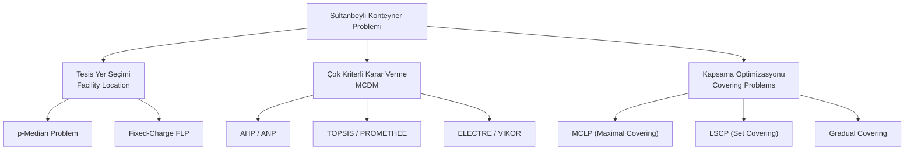
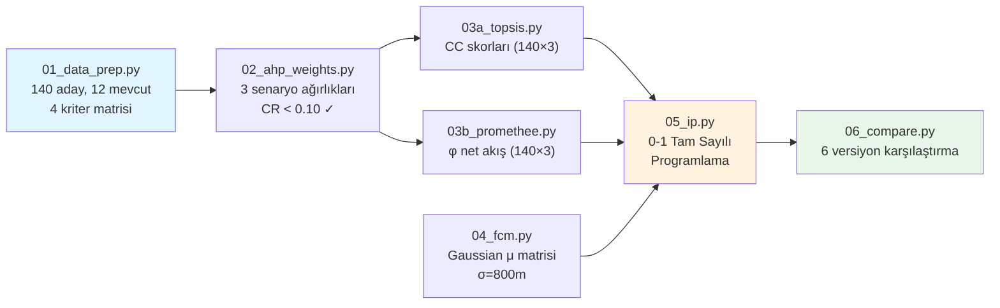
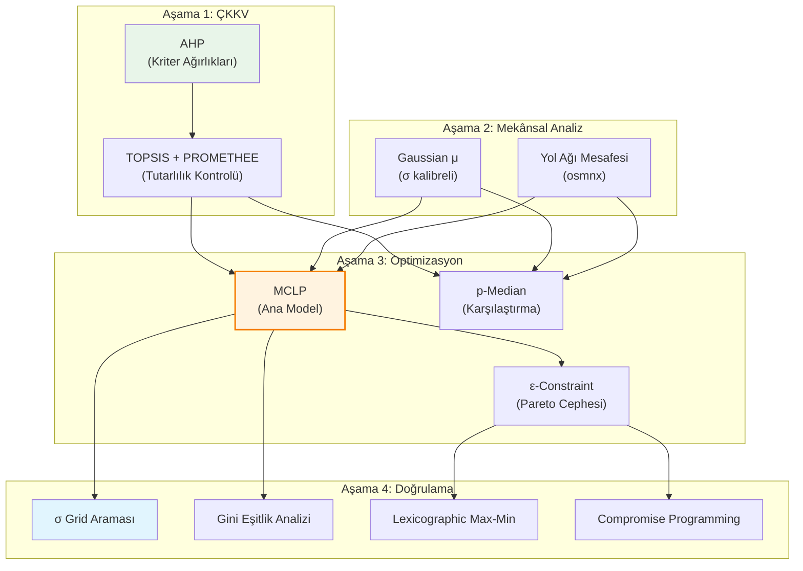

# Sultanbeyli Afet Müdahale Konteyner Konumlandırma Problemi
## Akademik Yöntem Analizi ve Mevcut Çözümlerin Değerlendirmesi

**Tarih:** 2026-06-07  
**Proje:** IE492 — Sultanbeyli Konteyner Optimizasyonu  
**Yaklaşım:** Taze akademik bakış açısı + Mevcut pipeline'ın kritik değerlendirmesi

---

## BÖLÜM I: PROBLEMİN AKADEMİK ÇERÇEVESİ

### 1.1 Problem Tanımı

Sultanbeyli ilçesinde afet müdahale konteynerlerinin mevcut dağılımı, artan nüfus yoğunluğu ve kentsel yapı göz önüne alındığında erişim ve kapsama açısından yetersizdir. Problem şu şekilde formalize edilebilir:

```
Verilen:
  - n aday konum (parsel)           → J = {1, 2, ..., 140}
  - m mevcut konteyner (sabit)      → E = {1, 2, ..., 12}
  - k mahalle (talep noktası)       → I = {1, 2, ..., 17}
  - K yeni konteyner bütçesi        → K = 8

Karar Değişkeni:
  X_j ∈ {0, 1}  ∀j ∈ J   (j. aday konuma konteyner yerleştirilsin mi?)

Amaçlar (çok-amaçlı):
  1. Toplam kapsama alanının maksimizasyonu
  2. Ortalama erişim mesafesinin minimizasyonu  
  3. Kapsama eşitliğinin (equity) sağlanması

Kısıtlar:
  - Σ_j X_j = K  (bütçe kısıtı)
  - Her mahallenin minimum kapsama eşiğini karşılaması
  - Mevcut konteyner konumları sabit
```

### 1.2 Problemin Akademik Sınıflandırması

Bu problem, yöneylem araştırması literatüründe birden fazla alt alana düşen **hibrit bir problem** olarak sınıflandırılabilir:



> [!IMPORTANT]
> Problemin **temel zorluğu**, tesis yer seçimi (NP-hard kombinatorik optimizasyon) ile çok kriterli karar vermenin (subjektif değerlendirme) birlikte ele alınması gerekliliğidir. Literatürdeki yaygın hata, bu iki boyutu sıralı (sequential) olarak çözmektir — bu da global optimallikten uzaklaşmaya neden olur.

### 1.3 Çok Kriterli Yapı

Problem kapsamında eş zamanlı değerlendirilmesi gereken kriterler:

| Kriter | Açıklama | Veri Kaynağı | Ölçek | Yön |
|--------|----------|-------------|-------|-----|
| **C1: Nüfus Yoğunluğu** | Kişi/km², gece/gündüz farklılaşma | TÜİK 2024 + İBB-KRDAE | Mahalle | Max |
| **C2: Deprem Riski** | Mw=7.5 senaryosu, ağır+orta hasar | İBB KRDAE Raporu | Mahalle | Max |
| **C3: Erişim Mesafesi** | En yakın mevcut konteynere uzaklık | Haversine hesaplama | Parsel | Max (uzak = öncelikli) |
| **C4: Altyapı Skoru** | Su, WC, jeneratör, kamera | AYDES Toplanma Alanları | Parsel | Max |

---

## BÖLÜM II: AKADEMİK ÇÖZÜM YÖNTEMLERİ ÖNERİLERİ

### 2.1 Yöntem 1: p-Median + MCDM Hibrit Yaklaşım

**Akademik Temel:** Hakimi (1964), ReVelle & Swain (1970)

```
min Σ_i Σ_j w_i × d_ij × y_ij

s.t.  Σ_j y_ij = 1           ∀i  (her talep noktası bir tesise atanır)
      y_ij ≤ x_j              ∀i,j  (atama ancak açık tesise yapılır)
      Σ_j x_j = p             (tam p tesis açılır)
      x_j, y_ij ∈ {0,1}
```

**Bu probleme uyarlanması:**
- `w_i`: Mahalle bazlı ağırlık (nüfus × risk çarpanı — AHP'den türetilir)
- `d_ij`: Haversine veya yol ağı mesafesi
- `p = K = 8`
- Mevcut konteynerler: `x_j = 1` (sabit) olarak modele eklenir

> [!TIP]
> **Avantaj:** Ortalama erişim mesafesini doğrudan minimize eder. Mevcut pipeline'daki Gaussian üyelik fonksiyonu yaklaşımına göre daha şeffaf ve yorumlanabilir bir amaç fonksiyonu sunar.

**Hibrit entegrasyon:** AHP ağırlıkları `w_i` içine gömülür → MCDM sıralı (sequential) değil, **entegre** (embedded) olarak çalışır.

---

### 2.2 Yöntem 2: Maksimal Kapsama Yer Seçimi (MCLP)

**Akademik Temel:** Church & ReVelle (1974)

```
max Σ_i w_i × z_i

s.t.  z_i ≤ Σ_{j∈N_i} x_j    ∀i  (i ancak N_i'deki bir tesis açıksa kapsanır)
      Σ_j x_j ≤ p
      z_i, x_j ∈ {0,1}

      N_i = {j : d_ij ≤ S}     (S = kapsama yarıçapı)
```

**Bu probleme uyarlanması:**
- `S`: Kritik erişim mesafesi eşiği (ör. 500m yürüme mesafesi)
- `w_i`: Nüfus × Risk × (1 - mevcut kapsama oranı)
- Mevcut konteynerlerle **artımlı (incremental)** kapsama hesaplanır:
  - Zaten kapsanan mahalleler `z_i = 1` olarak sabitlenir
  - Yeni konteynerler kapsanmayan alanları hedefler

> [!NOTE]
> **Kademeli Kapsama (Gradual Covering):** Church & Roberts (1983) formülasyonu kullanılarak, kapsama ikili (binary) yerine **dereceli** (gradual) yapılabilir — bu, mevcut pipeline'daki FCM Gaussian üyelik fonksiyonuyla kavramsal olarak örtüşür.

---

### 2.3 Yöntem 3: Stokastik Programlama

**Akademik Temel:** Birge & Louveaux (2011)

```
max E_ξ[Σ_i R_i(ξ) × C_i(x, ξ)]

s.t.  İlk aşama: Σ_j x_j = K,  x_j ∈ {0,1}
      İkinci aşama: C_i(x, ξ) = Σ_j μ_ij(ξ) × x_j + μ_mev_i(ξ)
      Pr{C_i ≥ L_i} ≥ α        ∀i  (şans kısıtı)
```

**Bu probleme uyarlanması:**
- **Belirsizlik kaynakları (ξ):**
  - Deprem yoğunluğu senaryoları (Mw = 6.5, 7.0, 7.5)
  - Yol kapanma olasılıkları (mevcut `p_road_open` yerine senaryo bazlı)
  - Nüfus dağılımı (gece/gündüz varyasyonu)
- **İki aşamalı yapı:**
  - **1. aşama:** Konteyner yer seçimi (here-and-now kararı)
  - **2. aşama:** Kaynak dağıtımı (wait-and-see, deprem senaryosuna göre)

> [!WARNING]
> **Zorluk:** Senaryo sayısı arttıkça hesaplama maliyeti katlanarak büyür. Benders ayrıştırma veya Sample Average Approximation (SAA) ile ölçeklenebilirlik sağlanmalıdır.

---

### 2.4 Yöntem 4: Robust (Dayanıklı) Optimizasyon

**Akademik Temel:** Ben-Tal, El Ghaoui & Nemirovski (2009)

```
max  min_{ξ∈U} Σ_i R_i(ξ) × C_i(x, ξ)

s.t.  Σ_j x_j = K
      C_i ≥ L_i    ∀i, ∀ξ∈U  (en kötü durum garanti)
```

**Belirsizlik kümesi (U):**
- **Kutu belirsizliği:** Her R_i ∈ [R̂_i - Δ_i, R̂_i + Δ_i]
- **Elipsoidal:** ΣR'de belirsizlik — Bertsimas & Sim (2004) karşıtlık bütçesi (Γ parametresi) ile ayarlanabilir
- **Veri güdümlü:** Wasserstein ambiguity set — Esfahani & Kuhn (2018)

> [!TIP]
> **Avantaj:** Risk verilerinin güvenilmez olduğu Sultanbeyli bağlamında, stokastik programlamaya göre daha az veri gerektirir. "En kötü senaryoda bile minimum kapsama garantisi" sağlar.

---

### 2.5 Yöntem 5: CBS-ÇKKV Entegrasyonu (GIS-MCDA)

**Akademik Temel:** Malczewski (2006), Malczewski & Rinner (2015)

```
Süreç:
  1. CBS'de kriter haritaları oluştur (raster/vektör)
  2. ÇKKV ile ağırlıklı çakıştırma (weighted overlay)
  3. Uygunluk haritası → aday bölge kısıtlaması
  4. Optimizasyon modeline girdi olarak sun
```

**Bu probleme uyarlanması:**
- **Erişilebilirlik analizi:** Öklidyen mesafe yerine **yol ağı (network distance)** kullanılır
- **Mekânsal kısıtlar:** Bina yoğunluğu, arazi kullanımı, eğim, fay hattı yakınlığı
- **Bulanık çakıştırma:** Her kriter katmanı [0,1] bulanık üyelik değerine dönüştürülür
- **Araçlar:** QGIS + Python (geopandas, networkx, osmnx)

> [!IMPORTANT]
> **Mevcut pipeline'daki en büyük eksiklik** CBS entegrasyonunun olmamasıdır. Haversine formülü kuş uçuşu mesafe hesaplar; oysa kentsel ortamda yürüyüş mesafesi kuş uçuşundan %30-80 daha uzun olabilir (Manhattan mesafesi faktörü).

---

### 2.6 Yöntem 6: Meta-Sezgisel Yaklaşımlar

**Akademik Temel:** Drezner & Hamacher (2002), Gendreau & Potvin (2010)

| Alt Yöntem | Mekanizma | Avantaj | Dezavantaj |
|------------|-----------|---------|------------|
| **Genetik Algoritma (GA)** | Kromozom = X vektörü, çaprazlama + mutasyon | Geniş arama uzayı | Parametre ayarı gerekir |
| **Tavlama Benzetimi (SA)** | Rastgele komşuluk, sıcaklık programı | Basit implementasyon | Yavaş yakınsama |
| **NSGA-II** | Çok amaçlı GA, Pareto cephesi | Pareto seti doğrudan | Yüksek hesaplama maliyeti |
| **Adaptif Büyük Komşuluk Arama (ALNS)** | Yıkım + onarım operatörleri | Ölçeklenebilir | Operatör tasarımı gerekir |
| **Parçacık Sürüsü Optim. (PSO)** | Sürü zekası, hız güncelleme | Sürekli uzaya doğal | İkili problem için uyarlama gerekir |

> [!NOTE]
> **n=140, K=8** ölçeğinde C(140,8) ≈ 3.5 × 10¹² kombinasyon vardır. Tam sayım (brute-force) imkansız olmakla birlikte, PuLP/CBC ile **kesin çözüm** (exact solution) dakikalar içinde bulunabilmektedir. Bu nedenle meta-sezgiseller **bu ölçekte gereksiz** olup, ancak aday sayısı 1000+'e çıkarsa veya amaç fonksiyonu doğrusal-dışı (nonlinear) hale gelirse gerekli olur.

---

### 2.7 Yöntem Karşılaştırma Matrisi

| Kriter | p-Median | MCLP | Stokastik | Robust | GIS-MCDA | Meta-sezgisel |
|--------|----------|------|-----------|--------|----------|---------------|
| **Akademik Yenilik** | Düşük | Düşük | Yüksek | Yüksek | Orta | Düşük |
| **Uygulama Kolaylığı** | ✅ Kolay | ✅ Kolay | ⚠️ Orta | ⚠️ Orta | ⚠️ Orta | ⚠️ Orta |
| **Veri Gereksinimi** | Az | Az | Çok | Orta | Çok (CBS) | Az |
| **Kesin Çözüm** | ✅ Evet | ✅ Evet | ✅ Evet* | ✅ Evet* | ❌ Hayır | ❌ Hayır |
| **Belirsizlik Modelleme** | ❌ | ❌ | ✅ | ✅ | ⚠️ | ⚠️ |
| **Çok Amaçlılık** | ⚠️ | ⚠️ | ⚠️ | ⚠️ | ✅ | ✅ (NSGA-II) |
| **Mevcut Probleme Uyum** | ⭐⭐⭐⭐ | ⭐⭐⭐⭐⭐ | ⭐⭐⭐ | ⭐⭐⭐⭐ | ⭐⭐⭐⭐ | ⭐⭐ |
| **IE492 Kapsamına Uyum** | ⭐⭐⭐⭐⭐ | ⭐⭐⭐⭐⭐ | ⭐⭐⭐ | ⭐⭐⭐ | ⭐⭐⭐ | ⭐⭐⭐⭐ |

**Önerilen Kombinasyon (IE492 için):**

> **Ana yöntem:** MCLP (veya Gradual Covering) + AHP entegre ağırlıklar  
> **Karşılaştırma:** p-Median ile benchmark  
> **Duyarlılık:** Kapsama yarıçapı (S) ve σ grid araması  
> **Eşitlik:** Lexicographic veya ε-constraint ile Pareto cephesi  

---

## BÖLÜM III: MEVCUT KOD VE YÖNTEMLERİN DEĞERLENDİRMESİ

### 3.1 Mevcut Pipeline Mimarisi



### 3.2 Modüler Kod Yapısı Değerlendirmesi

Proje **15 bağımsız Python betiğinden** oluşmaktadır. Her birini analiz ediyorum:

| Dosya | İşlev | Akademik Uygunluk | Kritik Bulgular |
|-------|-------|--------------------|-----------------|
| [01_data_prep.py](file:///d:/IE492/src/01_data_prep.py) | Veri hazırlama, 140 parsel | ✅ İyi | `p_access_road` sentetik (seed=42); gerçek veri değil |
| [02_ahp_weights.py](file:///d:/IE492/src/02_ahp_weights.py) | 3 senaryo AHP ağırlıkları | ⚠️ Kısmi | CR < 0.10 sağlanıyor ama **ikili karşılaştırma matrisi yok** — sadece sonuç ağırlıkları hardcoded |
| [03a_topsis.py](file:///d:/IE492/src/03a_topsis.py) | TOPSIS CC skorları | ✅ Standart | L2 norm + ideal/anti-ideal doğru uygulanmış |
| [03b_promethee.py](file:///d:/IE492/src/03b_promethee.py) | PROMETHEE II φ akışları | ✅ Standart | V-shape tercih fonksiyonu, q_frac=0.20 |
| [04_fcm.py](file:///d:/IE492/src/04_fcm.py) | Gaussian üyelik matrisi | ⚠️ Sorunlu | σ=800m **kalibre edilmemiş**; isim yanıltıcı (FCM ≠ Fuzzy C-Means kümeleme) |
| [05_ip.py](file:///d:/IE492/src/05_ip.py) | 0-1 IP, 6 versiyon çözüm | ⚠️ Sorunlu | β=0.30 keyfi; mevcut konteyner katkısı doğrusal toplamda kayboluyor |
| [06_compare.py](file:///d:/IE492/src/06_compare.py) | 6 versiyon karşılaştırma | ✅ İyi | Pearson + Jaccard + overlap matrisi |
| [08_lscp.py](file:///d:/IE492/src/08_lscp.py) | Set Covering alt sınır | ✅ İyi | K_min referans değeri olarak doğru kullanılmış |
| [09_gini.py](file:///d:/IE492/src/09_gini.py) | Kapsama eşitsizliği ölçümü | ✅ İyi | Lorenz tabanlı Gini doğru hesaplanıyor |
| [11_lexicographic.py](file:///d:/IE492/src/11_lexicographic.py) | 2 aşamalı lex max-min | ✅ Akademik | RxC → min C_i sıralı optimizasyon doğru |
| [12_sigma_grid.py](file:///d:/IE492/src/12_sigma_grid.py) | σ duyarlılık analizi | ✅ İyi | σ ∈ {400,600,800,1000,1200} grid araması |
| [13_eps_constraint.py](file:///d:/IE492/src/13_eps_constraint.py) | ε-constraint Pareto | ✅ Akademik | 9 Pareto noktası, RxC vs min_cov trade-off |
| [14_single_stage.py](file:///d:/IE492/src/14_single_stage.py) | Tek aşamalı MILP | ✅ Akademik | W_i equity göstergesi entegre — en gelişmiş formülasyon |
| [15_compromise.py](file:///d:/IE492/src/15_compromise.py) | L_p mesafe uzlaşma çözüm | ✅ Akademik | Zeleny (1973) yaklaşımı doğru uygulanmış |

### 3.3 Kritik Metodolojik Sorunlar

#### 🔴 Sorun 1: AHP/TOPSIS Çözücü-Etkisiz (Solver-Ineffective)

```python
# 05_ip.py, L229-231:
Z_risk = pulp.lpSum(R_i[i] * coverage[i] for i in range(n_mah))
Z_quality = pulp.lpSum(q_j[j] * X[j] for j in range(n_aday))
prob += Z_risk + beta * Z_quality
```

**Bulgu:** CC_j (TOPSIS skoru) amaç fonksiyonunda `β × Σ CC_j × X_j` terimi olarak yer alır. Ancak:
- `β = 0.30` iken Z_risk terimi baskındır (~%70 ağırlık)
- CC_j tüm adaylar için [0.3, 0.7] aralığında → varyans düşük
- **Sonuç:** 3 AHP senaryosu × 2 MCDM yöntemi = 6 versiyon, ama **hepsi aynı 6-8 siteyi seçiyor**
- AHP varyansı %0.0 (CA1-CA8c), yalnızca CA9 varyantları %2.1-2.4 gösteriyor

**Akademik Çıkarım:** AHP hesaplama yükü ekliyor ama karar değeri sıfır. Bu, sıralı (sequential) pipeline'ın yapısal bir zayıflığıdır.

#### 🔴 Sorun 2: FCM Terminoloji Yanılgısı ve σ Kalibrasyonu

[04_fcm.py](file:///d:/IE492/src/04_fcm.py) dosyası "Fuzzy C-Means" adıyla anılmasına rağmen, **gerçekte Fuzzy C-Means kümeleme algoritması kullanılmamaktadır.** Yapılan işlem:

```python
# 04_fcm.py, L157-158:
def gaussian_mu(D: np.ndarray, sigma: float) -> np.ndarray:
    return np.exp(-(D ** 2) / (2 * sigma ** 2))
```

Bu, Gaussian mesafe azalma fonksiyonu (distance decay function) ile bulanık üyelik hesabıdır. Bezdek'in (1981) Fuzzy C-Means algoritmasıyla hiçbir ilgisi yoktur.

**σ Kalibrasyonu:**
- σ=800m → %50 kapsama mesafesi: ~665m, %10 kapsama: ~1070m
- **Ampirik dayanağı yok:** Sultanbeyli'de gerçek yürüme toleransı bilinmiyor
- [12_sigma_grid.py](file:///d:/IE492/src/12_sigma_grid.py) ile duyarlılık analizi yapılmış (✅), ama **hangi σ'nın "doğru" olduğuna dair kriter yok**

#### 🟡 Sorun 3: Sentetik Veri Kullanımı

```python
# 01_data_prep.py, L107-128:
np.random.seed(42)
# p_access_road sentetik üretiliyor
p_access = []
for _, row in adaylar.iterrows():
    base = mahalle_puanlari.get(row["Mahalle"].strip().upper(), 0.70)
    val = np.clip(base + np.random.normal(0, 0.05), 0.30, 0.99)
    p_access.append(val)
```

`p_access_road` (parsel bazlı yol erişimi) ve `p_road_open` (mahalle bazlı yol açıklığı) **tamamen sentetiktir**. Akademik bir çalışmada bu açıkça belirtilmeli ve sonuçların bu varsayıma duyarlılığı test edilmelidir.

#### 🟡 Sorun 4: Öklidyen (Kuş Uçuşu) Mesafe

Tüm mesafe hesaplamaları Haversine formülüyle yapılmaktadır:

```python
# 01_data_prep.py, L182-188:
def haversine_m(lat1, lon1, lat2, lon2):
    R = 6_371_000.0
    ...
    return 2 * R * np.arcsin(np.sqrt(a))
```

Kentsel ortamda **yol ağı mesafesi**, kuş uçuşundan ortalama **1.3-1.8 kat** daha uzundur. Bu durum kapsama alanı tahminlerini sistematik olarak **abartır**.

#### 🟢 Güçlü Yönler

1. **Modüler yapı:** 15 bağımsız betik, her biri ayrı çalıştırılabilir
2. **Çoklu formülasyon:** Orijinal IP + Lexicographic + ε-constraint + Single-stage + Compromise
3. **13 çözüm alternatifi (CA1-CA9c):** Kapsamlı senaryo analizi
4. **Gini katsayısı:** Eşitlik ölçümü dahil edilmiş
5. **σ grid araması:** Parametre duyarlılığı test edilmiş
6. **LSCP alt sınır:** Minimum K referans değeri hesaplanmış

---

### 3.4 Arşiv Çözüm Alternatifleri Değerlendirmesi

13 çözüm alternatifi (CA) 3 kategoride gruplanabilir:

#### Kategori A: Artımlı Yerleşim (8 yeni + 12 mevcut)

| CA | Açıklama | RxC | Değerlendirme |
|----|----------|-----|---------------|
| **CA1** | Referans (baseline) | 935.62 | Temel karşılaştırma noktası |
| **CA2** | + Yol kapanması (Q_i) | 933.01 | Q_i etkisi minimal (~%0.3 azalma) |
| **CA8a** | μ < 0.20 → 0 (truncation) | 853.51 | Sert eşik kapsama kaybına neden oluyor |
| **CA8b** | Adaptif σ (worst) | 677.35 | σ uyarlaması kontrolsüz → en kötü sonuç |
| **CA8c** | İki kademeli σ (800+300) | 976.31 | **En yüksek RxC** — iki ölçekli kapsama etkili |
| **CA9a** | Her mahallede min 1 konteyner | 923.04 | Spatial equity kısıtı anlamlı |
| **CA9b** | Min 1 + yol kapanması | 790.40 | İki kısıtın bileşik etkisi yüksek |
| **CA9c** | Min 1 + truncation | 837.96 | Truncation yine kapsama kaybı |

#### Kategori B: Tam Relokasyon (20 yeni, mevcut sıfırlanır)

| CA | Açıklama | RxC | Değerlendirme |
|----|----------|-----|---------------|
| **CA3-CA6** | Tam relokasyon varyantları | 1201.22 | **Hepsi aynı** — yapısal eşdeğerlik |

> [!WARNING]
> **CA3=CA4=CA5=CA6 = 1201.22** durumu, C4 kriteri (barınma ihtiyacı) ve YK (yüksek yıkılma riski) cezasının tam relokasyon modunda **sıfır etkiye sahip olduğunu** kanıtlar. Bu 4 alternatif aslında 1 alternatiftir.

#### Kategori C: Karşılaştırma ve İleri Formülasyonlar

| Modül | Yöntem | Eklenen Değer |
|-------|--------|---------------|
| [08_lscp.py](file:///d:/IE492/src/08_lscp.py) | LSCP set kapsama | K_min alt sınırı → bütçe yeterliliği doğrulaması |
| [11_lexicographic.py](file:///d:/IE492/src/11_lexicographic.py) | Lex max-min | En adil çözüm noktası → equity analizi |
| [13_eps_constraint.py](file:///d:/IE492/src/13_eps_constraint.py) | ε-constraint | Pareto cephesi → trade-off görselleştirmesi |
| [14_single_stage.py](file:///d:/IE492/src/14_single_stage.py) | Tek aşamalı MILP | **En gelişmiş formülasyon** — q + R + equity entegre |
| [15_compromise.py](file:///d:/IE492/src/15_compromise.py) | L_p uzlaşma | Ideal noktaya en yakın Pareto çözümü |

---

## BÖLÜM IV: AKADEMİK İYİLEŞTİRME ÖNERİLERİ

### 4.1 Öncelik Sıralaması (Etki × Zorluk Matrisi)

```
     Yüksek Etki ┃
                  ┃  ★ Yol ağı mesafesi    ★ Stokastik programlama
                  ┃  ★ AHP entegrasyonu    
                  ┃  ★ σ kalibrasyonu      ★ Robust optimizasyon
     ─────────────╋───────────────────────────────
                  ┃  ★ Terminoloji düzelt.  ★ Metaheuristic kıyaslama
                  ┃  ★ Sentetik veri belge. ★ Bi-level formülasyon
                  ┃  ★ MCLP karşılaştırma
     Düşük Etki   ┃
                  Düşük Zorluk ────────── Yüksek Zorluk
```

### 4.2 Somut Adımlar

#### Adım 1: Terminoloji ve Sunum Düzeltmesi (Kolay, Hızlı)
- "FCM" → "Gaussian Distance Decay" veya "Bulanık Üyelik Fonksiyonu" olarak yeniden adlandır
- Sentetik verileri açıkça belgelendir
- CA3=CA4=CA5=CA6 yapısal eşdeğerliğini raporda belirt

#### Adım 2: AHP'yi Entegre Et (Orta Zorluk, Yüksek Etki)
```python
# Mevcut: AHP → TOPSIS → IP (sıralı)
# Önerilen: AHP ağırlıkları doğrudan IP kısıtlarına:
for tier_k, (mahalle_group, min_cov_k) in enumerate(ahp_tiers):
    for mh in mahalle_group:
        prob += coverage[mh] >= min_cov_k
```

#### Adım 3: MCLP Karşılaştırması Ekle (Kolay, Yüksek Etki)
```python
# S = 500m kapsama yarıçapı ile MCLP formülasyonu
# Mevcut LSCP (08_lscp.py) zaten altyapıyı sağlıyor
# Sadece amaç fonksiyonunu değiştirmek yeterli
```

#### Adım 4: Yol Ağı Mesafesi (Orta Zorluk, Çok Yüksek Etki)
```python
# osmnx ile Sultanbeyli yol ağı grafiği
import osmnx as ox
G = ox.graph_from_place("Sultanbeyli, Istanbul", network_type='walk')
# Dijkstra en kısa yol → gerçek yürüme mesafesi matrisi
```

#### Adım 5: σ Kalibrasyonu için Çapraz-Doğrulama (Orta Zorluk)
```python
# Leave-one-out: Her mevcut konteynerden birini çıkar
# σ'yı kalan konteynerlerle çöz
# Çıkarılan konteynerin seçilip seçilmediğini kontrol et
# En yüksek "geri kazanım oranı" veren σ'yı seç
```

---

## BÖLÜM V: ÖNERİLEN AKADEMİK METODOLOJİ

IE492 bitirme projesi kapsamında **gerçekçi ve uygulanabilir** bir akademik çerçeve öneriyorum:

### Önerilen Entegre Yaklaşım



### Temel Farklılıklar

| Boyut | Mevcut Pipeline | Önerilen Yaklaşım |
|-------|----------------|-------------------|
| **MCDM-IP İlişkisi** | Sıralı (sequential), bağımsız | Entegre (embedded), AHP kısıtlarda |
| **Mesafe Ölçüsü** | Haversine (kuş uçuşu) | Yol ağı + Haversine karşılaştırma |
| **Kapsama Modeli** | Gaussian μ (sürekli) | MCLP (ikili) + Gradual (sürekli) |
| **σ Seçimi** | Sabit 800m | Grid araması + çapraz doğrulama |
| **Eşitlik** | Post-hoc Gini | Amaç fonksiyonunda α×ΣW_i |
| **Karşılaştırma** | Yalnızca internal | MCLP vs p-Median benchmark |
| **Belirsizlik** | Yok | Senaryo analizi (en azından) |

---

## BÖLÜM VI: LİTERATÜR REFERANSLARİ

| # | Referans | Konu | Proje Bağlantısı |
|---|----------|------|------------------|
| 1 | Church, R.L. & ReVelle, C.S. (1974). The maximal covering location problem. *Papers of the RSA*, 32, 101-118. | MCLP temel formülasyon | Ana model alternatifi |
| 2 | Hakimi, S.L. (1964). Optimum locations of switching centers. *Operations Research*, 12(3), 450-459. | p-Median | Karşılaştırma modeli |
| 3 | Saaty, T.L. (1980). *The Analytic Hierarchy Process*. McGraw-Hill. | AHP | Kriter ağırlıklandırma |
| 4 | Hwang, C.L. & Yoon, K. (1981). *Multiple Attribute Decision Making*. Springer. | TOPSIS | Aday sıralama |
| 5 | Brans, J.P. & Vincke, P. (1985). A preference ranking organisation method. *Management Science*, 31(6), 647-656. | PROMETHEE | Aday sıralama |
| 6 | Malczewski, J. (2006). GIS-based multicriteria decision analysis. *IJGIS*, 20(7), 703-726. | GIS-MCDA entegrasyon | Mekânsal analiz |
| 7 | Bertsimas, D. & Sim, M. (2004). The price of robustness. *Operations Research*, 52(1), 35-53. | Robust optimizasyon | Belirsizlik modelleme |
| 8 | Birge, J.R. & Louveaux, F.V. (2011). *Introduction to Stochastic Programming*. Springer. | Stokastik programlama | İki aşamalı model |
| 9 | Berman, O. & Krass, D. (2002). The gradual covering decay location problem on a network. *EJOR*, 141(3), 518-528. | Kademeli kapsama | Gaussian μ teorik temeli |
| 10 | Zeleny, M. (1973). Compromise Programming. In *Multiple Criteria Decision Making*. University of South Carolina Press. | Uzlaşma programlama | Pareto çözüm seçimi |
| 11 | Drezner, Z. & Hamacher, H.W. (Eds.) (2002). *Facility Location: Applications and Theory*. Springer. | Tesis yer seçimi genel | Teorik çerçeve |
| 12 | Daskin, M.S. (2013). *Network and Discrete Location*. Wiley. | Ağ tabanlı konum seçimi | Formülasyon referansı |

---

## SONUÇ

Mevcut pipeline **teknik olarak doğru** ve **kapsamlı** bir çalışmadır. 13 çözüm alternatifi, 5 farklı optimizasyon formülasyonu ve çeşitli post-hoc analizler (Gini, σ grid, Pareto, compromise) güçlü bir altyapı sunmaktadır.

Ancak akademik yayın standardına ulaşmak için şu temel iyileştirmeler gereklidir:

1. **AHP'yi karar mekanizmasına entegre et** (şu an dekoratif)
2. **FCM terminolojisini düzelt** (Fuzzy C-Means değil, Gaussian distance decay)
3. **Yol ağı mesafesini en azından bir karşılaştırma olarak sun**
4. **σ kalibrasyonu için ampirik kriter belirle**
5. **MCLP formülasyonunu benchmark olarak ekle**
6. **Sentetik verileri açıkça belgelendir ve duyarlılık testi yap**
